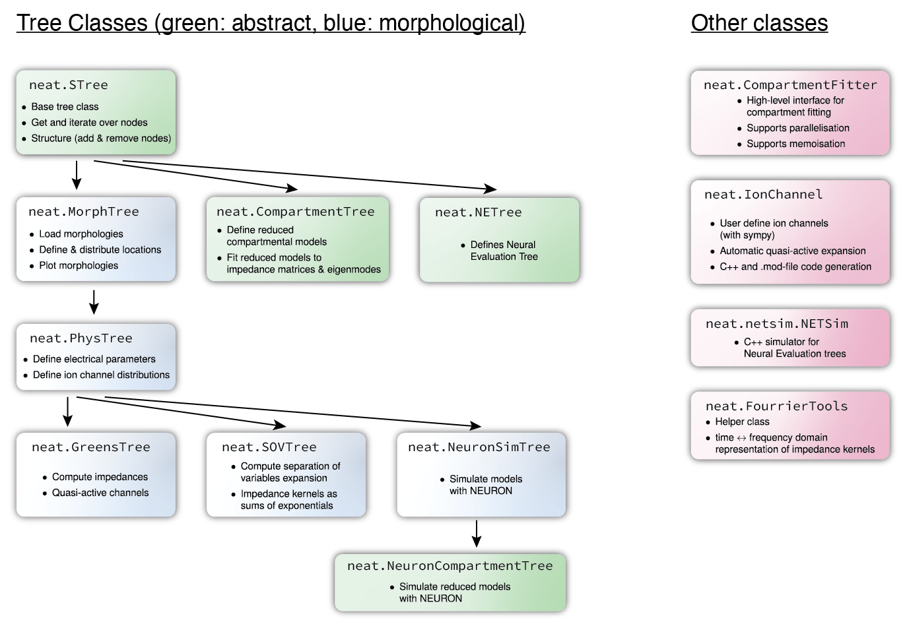
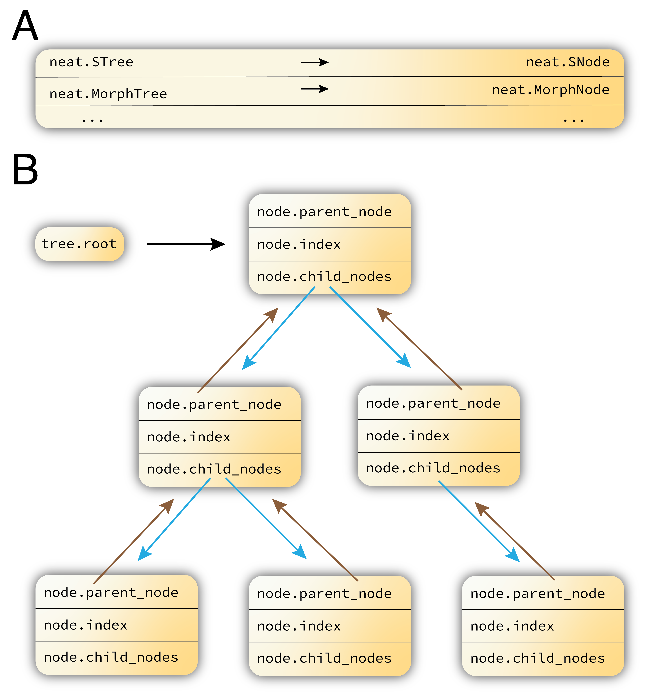

.. _contents:

Overview of NEAT
================

.. _NEAT: https://github.com/unibe-cns/NEAT

NEAT is a python library for the study, simulation and simplification of
morphological neuron models. NEAT accepts morphologies in the *de facto*
standard .swc format [Cannon1998]_, and implements high-level tools to interact
with and analyze the morphologies.

NEAT also allows for the convenient definition of morphological neuron models.
These models can be simulated, through an interface with the NEURON simulator
[Carnevale2004]_, or can be analyzed with two classical methods: *(i)* the
separation of variables method [Major1993]_ to obtain impedance kernels as
a superposition of exponentials and *(ii)* Koch's method to compute impedances
with linearized ion channels analytically in the frequency domain [Koch1985]_.
Furthermore, NEAT implements the neural evaluation tree framework [Wybo2019]_
and an associated C++ simulator, to analyze subunit independence.

Finally, NEAT implements a new and powerful method to simplify morphological
neuron models into compartmental models with few compartments [Wybo2020]_. For
these models, NEAT also provides a NEURON interface so that they can be
simulated directly, and will soon also provide a NEST interface [Gewaltig2007]_.

Structure
---------

NEAT's main functionality is implemented throught a number of tree classes.
`neat.STree` is the base class, implementing basic functionalities such as
getting and iterating over nodes, as well as adding and removing nodes. Each
class implements another layer of functionality over the class from which it
inherits. Figure 1 provides an overview of the inheritance structure.
For instance, `neat.MorphTree` inherits from `neat.STree`, and implements all
functionality to load, store and interact with morphologies. `neat.PhysTree`
then adds another layer of functionality by allowing the definition of
electrical parameters.

NEAT furthermore has a number of other classes, notably to implement ion
channels (`neat.IonChannel`) and to provide a high-level API for the
simplification method described in [Wybo2020]_ (`neat.CompartmentFitter`).

   **Figure 1.** Overview of NEAT structures. NEAT contains a number of tree classes,
   inheriting from `neat.STree`, as well as a number of helper classes.

A NEAT tree consists of nodes, and each tree class has a corresponding node class
(Figure 2A). A tree class contains a `root` attribute (Figure 2B), which points to the
corresponding node class instance that is the root of the tree (the soma, if
the tree is a `MorphTree` or a derived class). Each node has an index (by which
it can be accessed from the tree class), a reference to its parent node (``None``
if the node is the root), and a list containing references to its child nodes
(empty if the node is a leaf).

   **Figure 2.** Layout of a NEAT tree. **A:** Each NEAT tree consists of corresponding nodes.
   **B:** A tree contains a root node attribute, and each node has a parent node,
   an index and a list of child nodes.

Audience
--------

NEAT is of interest to neuroscientist who aim to understand dendritic
computation, and to explore dendritic computation at the network level.

Python
------

Python is a powerful programming language that allows simple and flexible
representations neural morphologies. Python has a vibrant and growing ecosystem
of packages that NEAT uses to provide more features such as numerical linear
algebra and drawing. In order to make the most out of NEAT you will want to know
how to write basic programs in Python. Among the many guides to Python, we
recommend the `Python documentation <https://docs.python.org/3/>`_ and the text
by Alex Martelli [Martelli03]_.

Free software
-------------

NEAT is free software; you can redistribute it and/or modify it under the
terms of the :doc:`GNU General Public License`.  We welcome contributions.
Join us on `GitHub <https://github.com/unibe-cns/NEAT>`_.

History
-------

NEAT was born in April 2018. The original version was designed and written by
Willem Wybo, based on code by Benjamin Torben-Nielsen. With help of Jakob
Jordan and Benjamin Ellenberger, NEAT became an installable python package with
documentation website.

Contributors are listed in :doc:`credits. <credits>`

Documentation
-------------

.. only:: html

    :Release: |version|
    :Date: |today|

.. toctree::
   :maxdepth: 1

   install
   tutorial
   source/index
   developer/index
   news
   license
   credits
   citing
   bibliography
   auto_examples/index

Indices and tables
------------------

* :ref:`genindex`
* :ref:`modindex`
* :ref:`search`
* :ref:`glossary`
